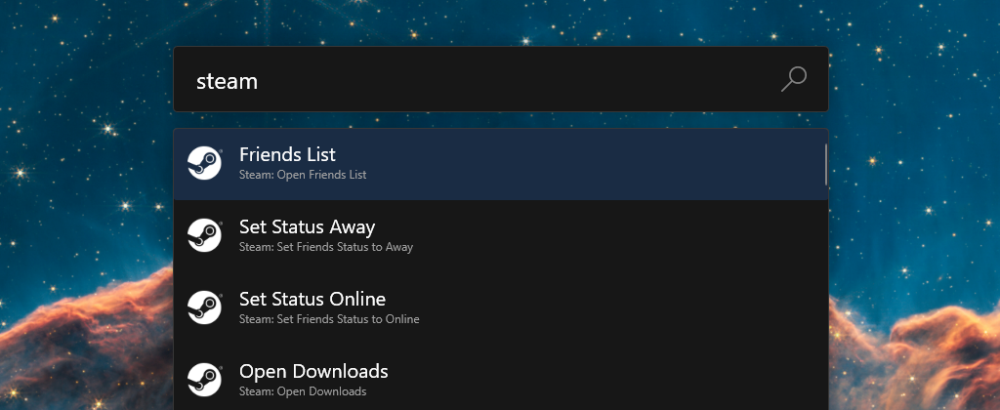

# PowerToys.Run.Plugin.Steam

A plugin for [PowerToys Run](https://learn.microsoft.com/en-gb/windows/powertoys/run) to add searchable Steam commands.

## Features

- Quickly toggle your Steam Status
- Open your friends list
- Jump to common Steam areas, such as Game Library, Store, Community Hub etc.

## Install

1. Download the latest release [here](https://github.com/AHollowedHunter/PowerToys.Run.Plugin.Steam/releases/latest)
2. Extract the zip file contents, and place the "Steam" folder within the PowerToys 'RunPlugins' directory.
   - Typical locations (try pasting either into Run to go straight there 😄):
     - System Install: `C:\Program Files\PowerToys\RunPlugins`
     - User Install: `%localappdata%\PowerToys\RunPlugins`
3. Restart PowerToys, and enjoy!

## Using

1. Open PowerToys Run
2. Start typing a query, either:

   - Type `s/` followed by a Steam feature, such as 'downloads', 'library', or 'friends list'. e.g. `s/friends`

   - Or if you have the plugin enable in global results, you can search without the command. Try 'friends list' or 'set status' and you should see results from this plugin.

#### Notes:

- `s/` is the default direct activation command, which limits results to only the plugin. You can change this in PowerToys Settings.
- You can enable/disable includsion in global results through PowerToys Settings. You will need to use the direct activation command if you disable global results for the plugin.

## Build

You can build this yourself, although the steps are not straightfoward. Adapted from the intructions [provided by bostrot](https://senpai.club/how-to-create-a-powertoys-run-plugin/).

1. Fork PowerToys locally - Follow the [PowerToys Dev Documentation](https://github.com/microsoft/PowerToys/tree/main/doc/devdocs) for getting your enviroment setup.
2. [Optional] Checkout a specific release tag from PowerToys, to ensure the plugin targets a current version of PowerToys (e.g. `git checkout tags/v0.75.1`)
3. [Optional] Create a branch on your PowerToys fork, to make updating from source easier.
4. Add this repository as a submodule into the `PowerToys/src/modules/launcher/Plugins` directory.
   1. Open a terminal window and cd into the `PowerToys/src/modules/launcher/Plugins` folder.
   2. `git submodule add git@github.com:AHollowedHunter/PowerToys.Run.Plugin.Steam.git PowerToys.Run.Plugin.Steam`
      - This clones this repository into the plugins directory, and adds it as a submodule of the PowerToys repo. This is why I suggest forking powertoys, checking out a release, and then branching.
5. Open `PowerToys.sln` in Visual Studio 2022.
6. Add this project to the solution, navigate to `PowerToys/src/modules/launcher/Plugins` and right-click the 'Plugins' folder, and select `Add > Existing Project`, and select `PowerToys.Run.Plugin.Steam.csproj`.
7. Build the solution (Follow the devdocs in step 1)
8. When you are done, you can build a 'Release' version, and copy the 'Steam' folder from `PowerToys\x64\Release\RunPlugins` into you installed PowerToys plugins (Per [Install](#Install))

## License

This project is licensed under the [MIT License](LICENCE.txt).

## Notices

Steam and the Steam logo are trademarks and/or registered trademarks of Valve Corporation in the U.S. and/or other countries.
